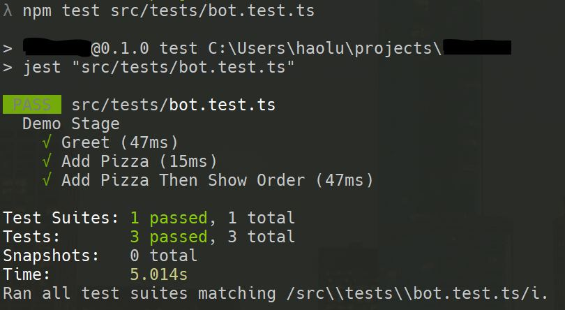

# Botbuilder Wolf Rive

As you build out your abilities with [Botbuilder Wolf](https://github.com/great-lakes/botbuilder-wolf), you'd want to test out your bot in an easy way.

**Now you can!**

With Wolf Rive, you can write readable tests using [Rivescript](https://www.rivescript.com/) in one or multiple `.rive` files.

## How to use

**1. Install:**

```
npm install --save-dev botbuilder-wolf-rive jest
```


**2. Build your Rivescript Test File:**
> Note: Rivescript syntax is very easy to write  
`> topic` is the start of a test conversation flow (Rivescript terminology: "topic").  
`+` is the start of a user utterance (Rivescript term: "trigger").  
`-` is the start of a bot response.  Bot can have multiple responses. 
`^` is the start of a new line for the bot response

If you're using vscode, you can install the rivescript extension for language support.

Here is an example of three test flows:
```
> topic greet
+ hi, my name is Hao
- Hello Hao! // this is a comment that will not be in the test

> topic add_pizza
+ i want a large pizza
- what toppings would you like on it?

+ extra cheese
- a large extra cheese pizza coming right up!

> topic add_pizza_then_show_order
+ i want a large pizza
- what toppings would you like on it?

+ extra cheese
- a large extra cheese pizza coming right up!

+ what did i order?
- this is what you ordered
^ a large extra cheese pizza
```

**3. Create your Test**
Behind the scenes, this test library is using Jest to run the tests.
And it needs to know a little more about your wolf configuration.

Create a new test files with the following code:

```js
/* global describe, test, expect */
import { parseRive, runWolfTests, createWolfRunner } from 'botbuilder-wolf-rive'
import abilities from '../abilities' // your abilities
import nlpWolf from '../nlp' // your nlp function

const wolfRunner = createWolfRunner(
  nlpWolf,
  () => abilities,
  'greet'
)

const demo = parseRive('./src/tests/demo.rive') // <=== Notice CWD is from the project root
// const sprint1 = parseRive('./src/tests/sprint1.rive')
// const sprint2 ...

describe('Demo Stage', () => {
  runWolfTests(demo, wolfRunner)
})
```

Both the nlp and ability functions can be async functions, however it will dramatically increase test duration if NLP is async.

Save this file in `src/tests/bot.test.js` (or `.ts`)

**4. Run your Test**
Replace the value of `scripts -> test` in your `package.json` like so:
```json
{
  /* ... */
  "scripts": {
    "test": "jest src/tests/bot.test"
  }
}
```

And run `npm test` will give you this:


## FAQ:
* **Why did you make this library?**

Testing is important, but testing a bot is not fun.  There seem to be a gap between unit testing every method of a bot and a full E2E test suite that requires the botbuilder.

This library aims to fill that gap for you.  It does not touch the bot `context`, and only test the wolf ability logic which takes in the user utterance and tests the `messageStringArray` property from wolf's outtake result.

* **How does the tests work?**

Each "topic" is a test conversation flow.  The topic name should be [snake cased](https://en.wikipedia.org/wiki/Snake_case).

The topic name should also be descriptive to what the flow is about, because this name is shown on the test report.

Each topic is run on a fresh `conversationState`, meaning one test conversation flow will not interfere or influence another flow.

* **Why did you use Rivescript?**

It has an easy-to-learn syntax that anyone can write.  I recognize that we are repurposing Rivescript a bit to use it as a testing tool, but isn't "repurposing to make lives better" what engineering is all about? :wink:

* **Hey wolf-rive does not support feature X of Rivescript**

This library is simply for testing.  It is not meant to replace wolf, or botbuilder for that matter.  Therefore, it currently does not support things like Rivescript's variables or topic inheritance.
